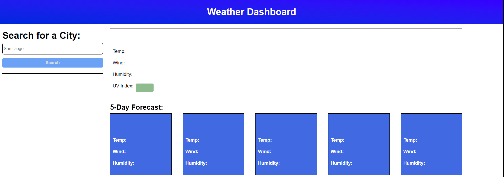

# Weather Dashboard

## Instructions:
Enter a city name and the current temperature and several other metrics will be displayed, along with the next 5 days of information.

## Details:

## Tools Used:

- VSCode
- JavaScript
- OpenWeather One Call API

## Website:

https://raymondcerneytech.github.io/Weather-Dashboard/

### Preview:

### Author:

Raymond Cerney

### License

This project is licensed under [MIT](https://opensource.org/licenses/MIT)

### Contact:

cerne004@gmail.com

LinkedIn: https://www.linkedin.com/in/raymondcerney/
